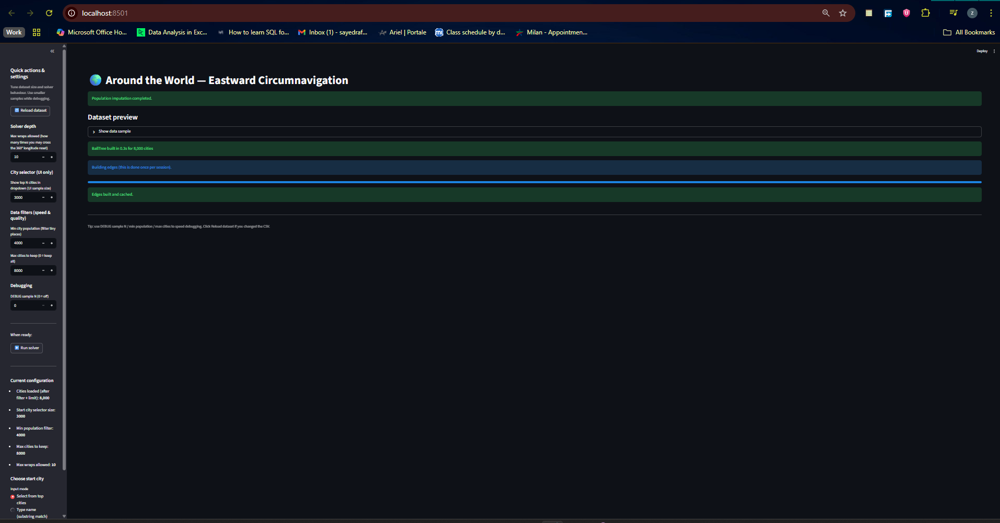

# 🌍 Around the World — Eastward Circumnavigation  

An interactive **Streamlit web application** that simulates the fastest possible **eastward journey around the world**, using real global city data and advanced geospatial algorithms.



---

# 📘 What This Project Is About

This project lets you explore the world using real data from **3M+ global cities**, performing:

- 🔵 BallTree nearest-neighbor search  
- 🌐 Haversine distance calculations  
- 🧭 Direction-aware eastward pathfinding  
- 🌎 Automatic wrap-around detection at longitude 360° → 0°  
- 📊 Rich visualizations and interactive maps  
- 🧪 Data cleaning + population imputation  

It combines **data science, GIS, and graph algorithms** into a visual, easy-to-use tool.

---

# 🎯 Why This Project Exists

Understanding global connectivity between cities is complex:

- Cities are unevenly distributed  
- Longitudes wrap around the planet  
- Nearest city ≠ best travel path  
- Large datasets are expensive to compute  

This project solves those challenges using:

- **BallTree spatial indexing** for fast lookups  
- **Custom weighted graph building**  
- **Dijkstra-like shortest path algorithm** with eastward-only constraint  
- **Interactive visual analysis**  

It transforms a complicated computational problem into an intuitive UI.

---

# 💡 How Users Benefit From This Project

### ✔️ 1. Learn Geospatial Algorithms  
Understand how:
- Haversine distance works  
- Nearest neighbors are computed  
- Wrap-around longitude logic functions  
- Direction-based travel paths are built  

Great for students & researchers.

---

### ✔️ 2. Explore Global Cities  
Pick any city (Tokyo, Milan, Dhaka, Sydney…) and instantly see:
- Its nearest neighbors  
- How travel decisions change by geography  
- Which cities form natural eastward routes  

---

### ✔️ 3. Visualize the Entire Round-the-World Journey  
You will see:
- 🌐 An interactive Folium map  
- 📉 Travel time per leg  
- 🧭 East vs West movement (blue = east, red = west)  
- 👥 Population changes along the route  
- 📍 Full route details (first 50 steps)  

---

### ✔️ 4. "Around the World in 80 Days" Challenge  
The app tells you instantly whether your route completes within **80 days (1920 hours)**.

---

# 🖥️ Live Features

| Feature | Description |
|--------|-------------|
| 🌐 World Cities Map | Interactive Folium world map showing the path |
| 🧭 Direction Coloring | Blue = eastward, Red = westward |
| 📈 Longitude Chart | Track eastward movement step by step |
| 🕒 Travel Time Chart | Shows travel duration between legs |
| 📊 Population Chart | Log-scale population trends |
| ✨ Smart Filters | Limit dataset by population & size |
| 🗂️ CSV Export | Saves route & summary automatically |


--- 

# This project requires:

- Python **3.9+**
- pip installed

## 🧪 How to Run the App

### ✅ 1. Clone the repository

```bash
git clone https://github.com/al-rafi-DSC/Tour_uni_Project.git
cd Tour_uni_Project


### ✅ 2. Install dependencies

```bash
pip install -r requirements.txt

### ✅ 2. Run streamlit app

```bash
streamlit run streamlit_app.py 